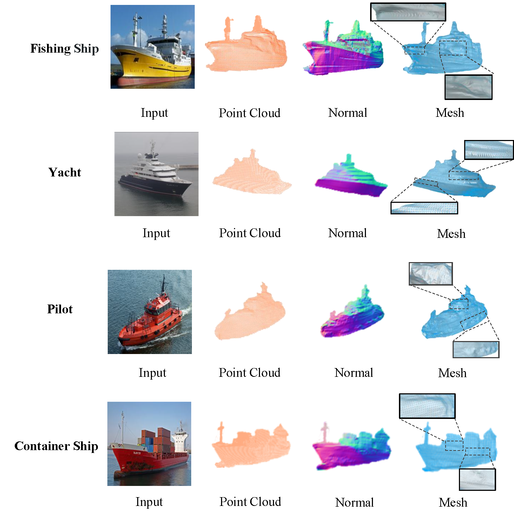

# Single-view 3D target perception based on Vessel-GAN for autonomous ships


**Figure:** *Autonomous ship 3D object modeling perception.*

In this repository, we present **Vessel-GAN**, which modeling the 3D shape of vessels.

## Requirements

* python>=3.6
* [pytorch](https://pytorch.org/)=1.1 or 1.2
* [neural_renderer](https://github.com/daniilidis-group/neural_renderer)
    ```sh
    pip install neural_renderer_pytorch  # or follow the guidance at https://github.com/elliottwu/unsup3d
    ```
* [mmcv](https://github.com/open-mmlab/mmcv)
    ```sh
    pip install mmcv
    ```
* other dependencies
    ```sh
    conda install -c conda-forge scikit-image matplotlib opencv pyyaml tensorboardX
    ```

## Dataset (HSSD)

For HSSD dataset, you can download it from https://drive.google.com/drive/folders/1BWwvjFFiC4LSHuHeynL9i-Y8mIKJvSFo?usp=drive_link


## Training

Before training, you may optionally compile StyleGAN2 operations, which would be faster:
```sh
cd shape_generate/stylegan2/stylegan2-pytorch/op
python setup.py install
```

**Example**: training on fishing images:
```sh
sh scripts/run_fishing.sh
```
This would run on a GPU by default. You can view the results at `results/fishing/images` or Tensorboard.


**Figure:** *Generation Process*

**Note**:  
- For other types of ships, you can revise the category in config. (./configs/fishing.yml)  
- For different ship images, the quality of StyleGAN2 influence the quality of 3D generation results vary a lot, thus you may need to test each image on GAN inversion before start our code.
- For HSSD dataset, you can use it for more vison task

## TODO LIST

- [x] Training code
- [ ] Completely 3D modeling result
- [ ] Training Vessel-GAN with more ship image

## Acknowledgement

Part of the code is borrowed from [GAN2Shape](https://github.com/XingangPan/GAN2Shape) and [StyleGAN2](https://github.com/rosinality/stylegan2-pytorch). 

